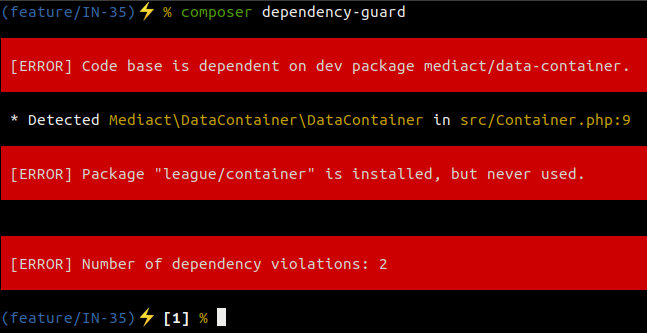
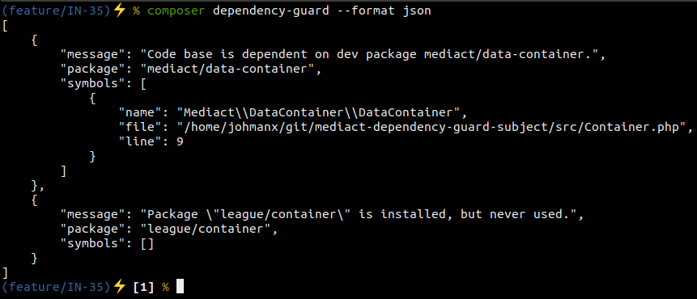

[](https://packagist.org/packages/mediact/dependency-guard)
[](https://packagist.org/packages/mediact/dependency-guard)
[](https://scrutinizer-ci.com/g/mediact/dependency-guard/?branch=master)
[](https://scrutinizer-ci.com/g/mediact/dependency-guard/?branch=master)
[](https://scrutinizer-ci.com/g/mediact/dependency-guard/build-status/master)
[](https://scrutinizer-ci.com/code-intelligence)

# Introduction

MediaCT Dependency Guard is a static code analyzer that determines whether your
package is depending on code that is installed as a side-effect of your developer
and / or test environment.

# Installation

```
composer require --dev mediact/dependency-guard
```

The tool can then be used in 3 ways:

1. As a composer command
2. As a stand-alone command
3. As GrumPHP task

# Composer command

```
composer dependency-guard
```

# Stand-alone

```
vendor/bin/dependency-guard
```

# GrumPHP task

Invoke GrumPHP using the provided [configuration](docs/grumphp.md).

# Usage

When running the DependencyGuard, it will look for all files that are accessible
through the autoload configuration of `composer.json`.

It will traverse all files, trying to detect PHP files and then determining the
symbols (class, interface, trait) used by each file.

When the symbols are gathered, it determines to which package each symbol belongs.
If a package is detected that is not installed because of the `require` section,
but because of the `require-dev` section in `composer.json`, a violation is
registered.

Also, when it is determined that a package is installed, while no code is using
that package, another violation is registered.



In the example above, the package `mediact/data-container` is installed as dev
package, yet used directly in the code of the current package.

Additionally, the package `league/container` is installed, but none of its code
is directly used.

To use custom reporting of these violations, JSON is supported as export format:



# Configuring exceptions

There are circumstances when dependency violations happen intentionally.

## Suggest

For instance, when a package is supplying factories for multiple implementations
of a specific factory, that require different packages for each factory. In that
case, the package would require those implementations as dev-package, and also
list them under the [`suggest`](https://getcomposer.org/doc/04-schema.md#suggest)
section of their `composer.json`.

When a package is added to the `suggest` section, its violations are ignored by
the dependency guard:

```json
{
  "require": {
    "psr/http-message-implementation": "@stable"
  },
  "require-dev": {
    "guzzlehttp/psr7": "^1.4"
  },
  "suggest": {
    "guzzlehttp/psr7": "To use the Guzzle PSR7 implementation."
  }
}
```

## Exclude symbols

To exclude specific symbols, add the following to the
`extra.dependency-guard.exclude` section of `composer.json`:

```json
{
  "extra": {
    "dependency-guard": {
      "exclude": [
        "Specific\\Class\\To\\Exclude",
        "Specific\\Namespace\\",
        "Some\\Class\\Matching\\Foo*"
      ]
    }
  }
}
```

Symbols can be excluded using an exact match, a namespace match or a pattern used
by [fnmatch](http://php.net/manual/en/function.fnmatch.php).

The configuration above will exclude:

- `Specific\Class\To\Exclude`
- `Specific\Namespace\Bunny`
- `Some\Class\Matching\FooBarBaz`

## Ignore packages

To ignore violation messages for a specific package, add the following to the
`extra.dependency-guard.ignore` section of `composer.json`:

```json
{
  "extra": {
    "dependency-guard": {
      "ignore": [
        "acme/tnt",
        "symfony/",
        "league/fly*"
      ]
    }
  }
}
```

Packages can be ignored using an exact match, a vendor match or a pattern used
by [fnmatch](http://php.net/manual/en/function.fnmatch.php).

The configuration above will ignore violations for the following packages:

- `acme/tnt`
- `symfony/console`
- `league/flysystem`

# Known limitations

Some scenarios cannot be covered by Dependency Guard, in its current form.
Known limitations are listed below:

## 🦊 Pokémon exception handling combined with integration tests

[Pókemon exception handling](http://wiki.c2.com/?PokemonExceptionHandling) is also known as:

- :stars: [Yoda Exception Handling](http://wiki.c2.com/?YodaExceptionHandling)
- :trollface: [Error Hiding](https://en.wikipedia.org/wiki/Error_hiding)
- :poop: [Diaper pattern](http://mike.pirnat.com/2009/05/09/the-diaper-pattern-stinks/)

This methodology catches any and all exceptions and either forwards them or ignores them:

```php
<?php
try {
    doSomething();
} catch (Throwable $exception) {
    // Do nothing.
}
```

When this is used to handle exceptions in an application, the following issue is caused by
running integration tests on that code.

When the test sets an expectation / assertion, the assertion may fail. When the assertion
fails, it throws a corresponding exception, which is meant to be caught by the test framework.

Instead it is caught by the exception handling as described above. To counteract this, the
following ends up in production code:

```php
<?php
try {
    doSomething();
} catch (\PHPUnit\Framework\AssertionFailedError $assertionException) {
    // Re-throw the exception, as it is part of the testing framework.
    throw $assertionException;
} catch (Throwable $exception) {
    // Do nothing.
}
```

The code above causes DependencyGuard, to detect that
`\PHPUnit\Framework\AssertionFailedError` is a symbol that can only be available when
a development installation is used. It may be expected that, since this symbol is only
used within a `catch`, it is not "really" a dependency, as it will only be autoloaded
when that specific `catch` is reached. DependencyGuard does no such specific inspection
of the symbol at hand. The exception is thus marked as dependency violation.

There are currently no plans to solve this. That being said, pull requests and open
discussions on this matter are welcomed.

